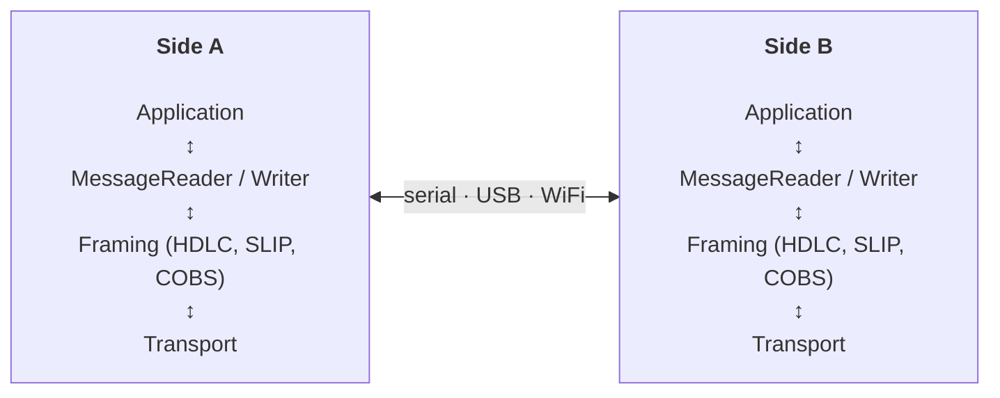

# embedded-bridge

Communication stack for embedded systems. Each language implementation is a
peer — it speaks the same wire protocol and can sit on either side of the
link (device or host).



The typical case is **C++ on the device** (embedded firmware) and **Python
on the host** (tools, test runners, dashboards), but every implementation is
platform-neutral — the C++ library compiles on desktop and embedded targets
alike, and the Python library has no OS-specific dependencies.

## Status

| Feature | Design | Docs | Impl | Tests | Since | Updated |
|---------|--------|------|------|-------|-------|---------|
| **Message protocol (C++)** | [design.md](docs/design.md) | [README](#mix-text-commands-and-binary-data-on-one-serial-link) | [message.h](cpp/include/embedded_bridge/message.h), [writer.h](cpp/include/embedded_bridge/writer.h) | [test_message](cpp/test/test_message.cpp) | 0.1.0 | 2026-03-03 |
| **Message protocol (Python)** | [design.md](docs/design.md) | [README](#mix-text-commands-and-binary-data-on-one-serial-link) | [message.py](python/src/embedded_bridge/framing/message.py) | [test_message](python/tests/test_message.py), [test_wire](python/tests/test_wire.py) | 0.1.0 | 2026-03-03 |
| **HDLC framing (C++ & Python)** | [design.md](docs/design.md) | [README](#communicate-reliably-over-noisy-uart) | [hdlc.h](cpp/include/embedded_bridge/framing/hdlc.h), [hdlc.py](python/src/embedded_bridge/framing/hdlc.py) | [test_hdlc.cpp](cpp/test/test_hdlc.cpp), [test_hdlc.py](python/tests/test_hdlc.py) | 0.1.0 | 2026-03-13 |
| **SLIP framing (C++ & Python)** | [design.md](docs/design.md) | [README](#communicate-reliably-over-noisy-uart) | [slip.h](cpp/include/embedded_bridge/framing/slip.h), [slip.py](python/src/embedded_bridge/framing/slip.py) | [test_slip.cpp](cpp/test/test_slip.cpp), [test_slip.py](python/tests/test_slip.py) | 0.1.0 | 2026-03-13 |
| **COBS framing (C++ & Python)** | [design.md](docs/design.md) | [README](#communicate-reliably-over-noisy-uart) | [cobs.h](cpp/include/embedded_bridge/framing/cobs.h), [cobs.py](python/src/embedded_bridge/framing/cobs.py) | [test_cobs.cpp](cpp/test/test_cobs.cpp), [test_cobs.py](python/tests/test_cobs.py) | 0.1.0 | 2026-03-13 |
| **LineFramer (Python)** | [design.md](docs/design.md) | — | [line.py](python/src/embedded_bridge/framing/line.py) | [test_line_framer](python/tests/test_line_framer.py) | 0.1.0 | 2026-03-03 |
| **CRC-16 (C++ & Python)** | — | — | [crc16.h](cpp/include/embedded_bridge/detail/crc16.h), [crc16.py](python/src/embedded_bridge/framing/crc16.py) | [test_crc16.cpp](cpp/test/test_crc16.cpp), [test_crc16.py](python/tests/test_crc16.py) | 0.1.0 | 2026-03-03 |
| **SerialTransport (Python)** | — | — | [serial.py](python/src/embedded_bridge/transport/serial.py) | [test_serial](python/tests/test_serial_transport.py) | 0.1.0 | 2026-03-03 |
| **WebSocketTransport (Python)** | — | [README](#connect-via-websocket-bridge) | [websocket.py](python/src/embedded_bridge/transport/websocket.py) | [test_websocket](python/tests/test_websocket_transport.py), [integration](python/tests/integration/test_websocket_transport_integration.py) | next | 2026-04-23 |
| **CrashDetector** | — | [README](#detect-device-crashes) | [crash_detector.py](python/src/embedded_bridge/receivers/crash_detector.py) | [test_crash](python/tests/test_crash_detector.py) | 0.1.0 | 2026-03-03 |
| **EventCapture** | — | [README](#capture-timestamped-events-for-power-profiling) | [event_capture.py](python/src/embedded_bridge/receivers/event_capture.py) | [test_events](python/tests/test_event_capture.py) | 0.1.0 | 2026-04-23 |
| **SleepWakeMonitor** | — | [README](#monitor-sleepwake-transitions) | [sleep_wake.py](python/src/embedded_bridge/receivers/sleep_wake.py) | [test_sleep](python/tests/test_sleep_wake.py) | 0.1.0 | 2026-03-03 |
| **MemoryTracker** | — | — | [memory_tracker.py](python/src/embedded_bridge/receivers/memory_tracker.py) | [test_memory](python/tests/test_memory_tracker.py) | 0.1.0 | 2026-04-14 |
| **Router** | — | [README](#route-mixed-output-to-multiple-receivers) | [router.py](python/src/embedded_bridge/receivers/router.py) | [test_router](python/tests/test_router.py) | 0.1.0 | 2026-03-03 |
| **TestSession** | — | [README](#run-device-tests-with-sleepwake-handling) | [session.py](python/src/embedded_bridge/testing/session.py) | [test_session](python/tests/test_test_session.py) | 0.1.0 | 2026-04-23 |

## Language implementations

Each language lives in its own top-level directory with its own build system,
tests, and packaging:

| Directory | Language | Layers |
|-----------|----------|--------|
| `cpp/`    | C/C++ (header-only, C++17) | Message protocol, framing (HDLC, SLIP, COBS) |
| `python/` | Python 3.10+ | Message protocol, framing, transport, receivers, test orchestration |

The **core protocol** (message reader/writer, framing, CRC-16) is
implemented in both languages — these are matched peers that interoperate
on the wire. The Python implementation additionally includes higher-level
modules (serial transport, crash detection, sleep/wake monitoring, test
orchestration) that are useful on the host side but not part of the wire
protocol itself.

**Want to add another language?** Create a top-level directory (e.g. `rust/`,
`typescript/`, `go/`) with a matching implementation of the wire protocol.
The shared test vectors in each language's test suite define the expected
behavior — a new implementation should pass equivalent tests.

## What you can do with it

### Mix text commands and binary data on one serial link

The message protocol lets text and binary coexist. Text ends at `\n`,
binary starts with SOH + version + length. Both sides use the same wire
format — no custom parsers needed.

**Device (C++):**

```cpp
#include <embedded_bridge/message.h>

MessageWriter writer(serial_write);
writer.write_text("{\"cmd\":\"status\",\"ok\":true}");
writer.write_binary(sensor_buffer, sensor_len);
```

**Host (Python):**

```python
from embedded_bridge.framing.message import MessageReader, MessageWriter

reader = MessageReader()
reader.feed(serial_data)

for msg in reader.drain():
    if isinstance(msg, str):
        handle_json(msg)
    else:
        save_sensor_data(msg)
```

### Stream large transfers without buffering

Both sides support streaming — the writer emits the header (with length)
upfront, then streams payload chunks. The reader delivers chunks as they
arrive.

**Device — stream a 50 KB capture:**

```cpp
MessageWriter writer(serial_write);
writer.begin_binary(capture_size);
while (bytes_remaining > 0) {
    size_t chunk = min(bytes_remaining, 512);
    writer.write(buffer, chunk);
    bytes_remaining -= chunk;
}
writer.end();
```

**Host — receive without holding it all in memory:**

```python
from embedded_bridge.framing.message import MessageReader, StreamingMessageHandler

class CaptureHandler(StreamingMessageHandler):
    def on_binary_start(self, length: int) -> None:
        self.file = open("capture.bin", "wb")

    def on_binary_data(self, chunk: bytes) -> None:
        self.file.write(chunk)

    def on_binary_end(self) -> None:
        self.file.close()

reader = MessageReader(CaptureHandler())
```

### Communicate reliably over noisy UART

HDLC, SLIP, and COBS framers provide byte-level integrity on unreliable
transports. The framers sit below the message protocol — both layers are
independent.

**Device (C++):**

```cpp
#include <embedded_bridge/framing/hdlc.h>

HdlcFramingWriter<256> framed_output(raw_serial);
MessageWriter writer(framed_output);

// Messages are automatically framed with CRC-16
writer.write_text("{\"cmd\":\"ack\"}");
```

**Host (Python):**

```python
from embedded_bridge.framing import HdlcFramer, HdlcFrameEncoder

framer = HdlcFramer(lambda payload: reader.feed(payload))
framer.process_bytes(raw_uart_data)
```

On reliable transports (USB CDC, TCP), skip framing entirely — the message
protocol works directly on the byte stream.

### Detect device crashes

```python
from embedded_bridge.receivers.crash_detector import CrashDetector, ESP32_PATTERNS

detector = CrashDetector(patterns=ESP32_PATTERNS, silent_timeout=45.0)
detector.on_crash = lambda event: print(f"CRASH: {event.reason}")

for line in serial_output:
    detector.feed(line)
```

Detects Guru Meditation errors, backtrace dumps, watchdog resets, and
silent hangs. Works with any message source — serial, log replay, test runner.

### Capture timestamped events for power profiling

```python
from embedded_bridge.receivers.event_capture import EventCapture

capture = EventCapture()
capture.feed("T=0.001600 GPS_FIX_STARTED")
capture.feed("T=0.500000 GPS_FIX_STOPPED")

for span in capture.spans:
    print(f"{span.name}: {span.device_duration_s:.3f}s")
```

Pairs START/STOP markers with device and host timestamps for alignment
with PPK2 power measurements.

### Monitor sleep/wake transitions

```python
from embedded_bridge.receivers.sleep_wake import SleepWakeMonitor

monitor = SleepWakeMonitor(port_path="/dev/cu.usbmodem14301")
monitor.on_sleep = lambda e: print(f"Sleeping for {e.duration}s")
monitor.on_wake = lambda: print("Awake")
```

Detects sleep via serial patterns and USB-CDC port disappearance.

### Connect via WebSocket bridge

Talk to a device over a WebSocket — either through a serial-to-WebSocket
relay (e.g. [embedded-menu](https://github.com/m-mcgowan/embedded-menu)'s
browser dashboard bridge) or to a WebSocket endpoint hosted on the device
itself.

```python
from embedded_bridge.transport.websocket import WebSocketTransport

with WebSocketTransport("ws://localhost:8765") as transport:
    transport.write(b'{"cmd":"status"}\n')
    data = transport.read(timeout=1.0)
    print(data.decode())
```

Text and binary frames are both decoded to `bytes`, so the rest of the
stack (framing, receivers, `TestSession`) works identically whether the
link is serial or WebSocket. Pass `reconnect=True` to auto-recover from
server-side drops.

### Route mixed output to multiple receivers

```python
from embedded_bridge.receivers.router import Router

router = Router([
    (event_capture,  lambda msg: isinstance(msg, str) and msg.startswith("T=")),
    (crash_detector, None),  # receives everything
])
```

### Run device tests with sleep/wake handling

```python
from embedded_bridge.testing.session import TestSession

session = TestSession(transport)
catalog = session.discover()
for test in catalog["tests"]:
    session.start_test(test["id"])
    outcome = session.monitor(test["id"])
```

Handles discovery, sleep detection (USB-CDC disappearance), automatic
reconnection on wake, and marker collection.

## Architecture

The stack is layered with each layer independent of the others:

| Layer | C++ | Python |
|-------|-----|--------|
| **Message protocol** | MessageReader/Writer | MessageReader/Writer |
| **Framing** | HDLC, SLIP, COBS | HDLC, SLIP, COBS |
| **Transport** | Serial, USB CDC | SerialTransport, WebSocketTransport |
| **Diagnostics** | — | CrashDetector, EventCapture, SleepWakeMonitor |

- Framing is optional — skip it on reliable transports
- The message protocol works on any byte stream (framed or raw)
- Receivers work without a transport (feed from log files, test runners)
- Each framing protocol has matched C++ and Python implementations with
  shared test vectors

### Wire protocol

**Text message:**
```
printable text...\n
```

**Binary message:**
```
SOH (0x01) | version (0x01) | varint length | payload bytes
```

Every message is self-identifying from its first byte. The length prefix
makes unknown messages skippable — a receiver that doesn't understand the
payload reads and discards `length` bytes to reach the next boundary.

## C++ (`cpp/`)

Header-only, C++17. No dependencies beyond the standard library (Arduino
`Print` adapter auto-detected via `__has_include`).

```
include/embedded_bridge/
    message.h                    — MessageReader/Writer, varint helpers
    writer.h                     — Writer base class and subclasses
    detail/
        crc16.h                  — CRC-16/HDLC
    framing/
        hdlc.h                   — HDLC framer + writer (CRC-16)
        slip.h                   — SLIP framer + writer
        cobs.h                   — COBS framer + writer
test/                            — Tests (doctest)
CMakeLists.txt
```

**Install — PlatformIO:**

```ini
lib_deps =
    https://github.com/m-mcgowan/embedded-bridge.git
```

**Install — CMake:**

```cmake
add_subdirectory(embedded-bridge/cpp)
target_link_libraries(my_app embedded_bridge)
```

**Run tests:**

```bash
cpp/test.sh
```

## Python (`python/`)

Python 3.10+. No required dependencies. `pyserial` is optional for
`SerialTransport` (`pip install embedded-bridge[serial]`); `websockets`
is optional for `WebSocketTransport` (`pip install embedded-bridge[websocket]`).

Includes the core wire protocol (message reader/writer, framing, CRC-16)
plus host-side utilities: serial transport, crash detection, sleep/wake
monitoring, event capture, and test orchestration.

```
src/embedded_bridge/
    framing/
        message.py               — MessageReader/Writer
        hdlc.py, slip.py, cobs.py — Matched framers
        crc16.py                 — CRC-16/HDLC
        line.py                  — LineFramer
        base.py                  — Framer protocol
    transport/
        serial.py                — SerialTransport (pyserial)
        websocket.py             — WebSocketTransport (websockets)
    receivers/
        crash_detector.py        — Crash/hang detection
        event_capture.py         — Timestamped event markers
        sleep_wake.py            — Sleep/wake transitions
        memory_tracker.py        — Per-test heap tracking
        router.py                — Message routing
    testing/
        session.py               — Test orchestration
tests/                           — Tests (pytest)
pyproject.toml
```

**Install:**

```bash
pip install "embedded-bridge @ git+https://github.com/m-mcgowan/embedded-bridge.git#subdirectory=python"
```

**Run tests:**

```bash
python/test.sh
```

## License

BSD-3-Clause
