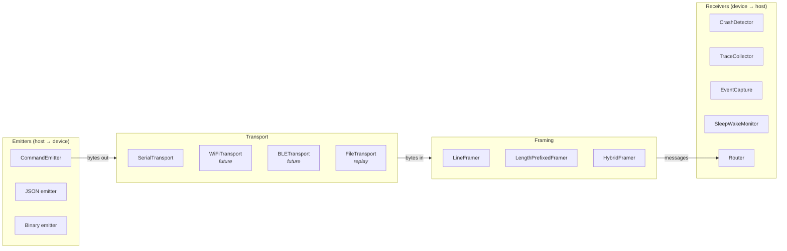
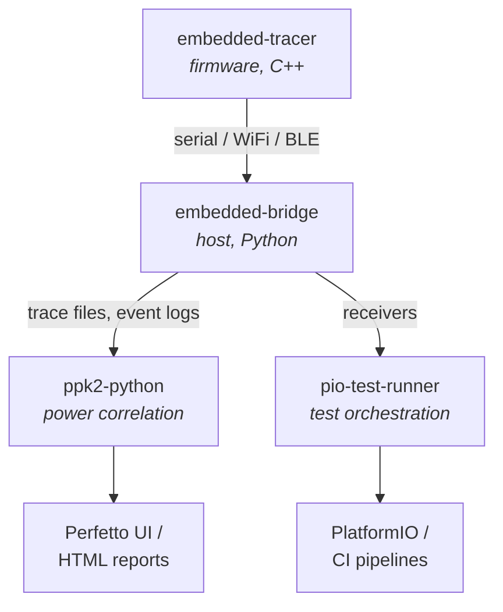

# embedded-bridge — Design

Python library for structured communication with embedded devices.
Provides pluggable transport, stream processing, crash detection, trace
collection, and event capture — the host-side counterpart to
embedded-tracer.

## Motivation

Interacting with embedded firmware from a host computer is a recurring
need across testing, profiling, provisioning, and debugging. The same
patterns keep getting reimplemented:

- ppk2-python's `EventMapper` receives timestamped events from serial
- PlatformIO's test runner disconnects/reconnects serial during upload
- Ad-hoc scripts send commands and scrape serial output
- Crash detection scripts pattern-match for backtraces and watchdog resets
- `serial-monitor` provides interactive terminal access

These all share the same structure: signals flow between a device and a
host. The differences are in *what* the signals mean and *how* they're
carried — but the plumbing is the same.

embedded-bridge separates the **transport** (how signals are carried)
from the **semantics** (what you send and receive) so both are
independently pluggable. Serial is the most common transport, but WiFi,
BLE, and file replay use the same receivers. Chrome JSON is the most
common trace format, but binary frames and event markers use the same
transport.

## Architecture

The bridge handles **bidirectional signals** between host and device.
Incoming signals (device → host) are consumed by **receivers**.
Outgoing signals (host → device) are produced by **emitters**. The
transport is merely the mechanism — the higher-level semantics
(commands, acks, traces, events) are independent of how bytes move.

A device could signal an ack via serial text, a GPIO toggle, or an I2C
register — the receiver interface is the same regardless.



### Stream processing pipeline

Everything starts as bytes. The incoming pipeline is:

1. **Transport** delivers raw bytes from the device
2. **Framing** segments bytes into messages — the framer handles mode
   detection, emitting text lines for line-oriented data and binary
   frames when it encounters a binary header (magic bytes, length
   prefix, etc.). A single stream can carry both — the framer is the
   mode detector.
3. **Receivers** consume messages at whatever level they need

Receivers hook in at the appropriate pipeline stage:

- `CrashDetector` → lines (pattern matching on text)
- `TraceCollector` → lines (Chrome JSON) or binary frames (drain)
- `SleepWakeMonitor` → lines (sleep/wake patterns)
- A raw logger → bytes (captures everything pre-framing)

This means receivers don't know about transport *or* framing. A
`CrashDetector` works the same whether its lines came from serial,
WiFi, or a log file replay.

The outgoing path is simpler — emitters produce bytes (text, JSON,
binary) that the transport sends to the device.

### Using receivers without a Bridge

The `Bridge` class wires the full pipeline for standalone use. But
receivers can be used independently — anything that can produce
messages can feed them:

- **PlatformIO test runners** feed lines from PIO's
  `on_testing_line_output()` callback — no transport or framing needed
- **Replay/analysis tools** feed lines from a log file
- **Custom integrations** feed from whatever source they have

The `Bridge` class is a convenience for the common case. It is not
required.

---

## Transport Layer

### Interface

```python
class Transport(Protocol):
    """Bidirectional byte stream to/from an embedded device."""

    def connect(self) -> None: ...
    def disconnect(self) -> None: ...
    def read(self, size: int = -1, timeout: float | None = None) -> bytes: ...
    def write(self, data: bytes) -> None: ...
    def is_connected(self) -> bool: ...

    @property
    def port_path(self) -> str | None:
        """Underlying port path, if applicable (for sleep/wake detection)."""
        ...
```

Transports deliver and accept raw bytes — they know nothing about
lines, frames, or message boundaries. Reconnection policy, port
discovery, and baud rate configuration are transport-specific concerns
handled by each implementation.

### SerialTransport

The primary transport. Wraps pyserial with:

- Connect by device name (via usb-device registry) or port path
- Baud rate configuration
- Non-blocking read with timeout
- Reconnect on disconnect (configurable policy)
- Exclusive access management
- Port existence checking (for detecting USB-CDC disappearance during
  deep sleep)

### FileTransport

Replays a captured log file as if it were a live device. Useful for
testing receivers and for offline analysis.

### Future transports

WiFi (TCP socket), BLE (via bleak), USB HID — all implement the same
`Transport` protocol. No receiver changes required.

---

## Framing Layer

Framers segment a byte stream into discrete messages. A single framer
can handle mixed-mode streams — detecting binary headers (magic bytes,
length prefixes) inline and switching between text and binary output
as needed, similar to how Notecard handles `card.binary` within a
text-based protocol.

### Interface

```python
class Framer(Protocol):
    """Segments a byte stream into messages."""

    def feed(self, data: bytes) -> None: ...
    def drain(self) -> list[bytes | str]: ...
```

The `drain()` method returns a mix of `str` (complete text lines) and
`bytes` (complete binary frames). Downstream receivers get whichever
type they're registered for.

### LineFramer

The default framer. Accumulates bytes, splits on newlines, emits
complete lines as strings. This is the right framer for most serial
output — Chrome JSON, event markers, log messages, test results.

### LengthPrefixedFramer

For binary protocols. Reads a length header, accumulates the payload,
emits complete frames as bytes. Used for BufferTracer binary drain.

### HybridFramer

Combines line and binary framing on a single stream. Default mode is
line-based; switches to binary when it detects a magic header. Returns
to line mode after the binary frame completes. This is the expected
default for most real-world use.

### Future framers

COBS-encoded frames, SLIP framing, etc. — each implements the same
`Framer` protocol.

---

## Receivers (incoming)

Receivers consume incoming messages from the device. Each receiver is
independent and can be used alone or composed with others via `Router`.

### Interface

```python
class Receiver(Protocol):
    """Consumes incoming messages from the device."""

    def feed(self, message: bytes | str) -> None: ...
```

Line-oriented receivers get strings (from `LineFramer`). Binary
receivers get bytes (from `LengthPrefixedFramer`). A receiver can
handle both if needed.

### CrashDetector

Monitors device output for crash indicators and hangs. This is a
general-purpose receiver — useful during testing, profiling, or any
long-running capture session.

**Crash patterns detected:**
- `Backtrace:` / `backtrace:` — ESP32 crash dump
- `Guru Meditation Error` — ESP-IDF fatal error
- `panic_abort` / `abort()` — libc abort
- `Task watchdog got triggered` / `WDT reset` — watchdog timeout

**Hang detection:**
- Silent hang — no output for configurable duration (default 45s)
- Activity hang — output flowing but no progress markers for configurable
  duration

```python
detector = CrashDetector(
    silent_timeout=45.0,
    patterns=CrashDetector.ESP32_PATTERNS,  # extensible
)
detector.on_crash = lambda reason: print(f"Crash: {reason}")

for line in stream:
    detector.feed(line)
```

Crash patterns are configurable per platform — ESP32 patterns ship
built-in, but users can add patterns for other MCUs.

### TraceCollector

Collects trace events from embedded-tracer output and produces
Perfetto-loadable trace files.

**Chrome JSON mode** — collects lines matching `{"ph":...}` from
SerialTracer output:

```python
collector = TraceCollector()
# ... feed lines ...
collector.write("trace.json")  # {"traceEvents": [...]}
```

**Binary drain mode** — receives BufferTracer drain frames (header +
packed events + checksum) and converts to Chrome JSON. The binary
protocol is defined in embedded-tracer's `buffer_tracer.h`.

**Clock correlation** — records host-side timestamps alongside device
timestamps so that trace events can be aligned with external
measurements (PPK2 power data, host-side logs).

### EventCapture

Receives `T=<timestamp> <NAME>_STARTED/STOPPED` markers (the PPK2
EventMapper protocol). Maintains an event log with both device and host
timestamps.

```python
capture = EventCapture()
capture.feed("T=0.001600 GPS_FIX_STARTED")
capture.feed("T=0.004200 GPS_FIX_STOPPED")
# capture.events → structured event log
```

Bridges between embedded-tracer serial output and ppk2-python's
EventMapper channel encoding. This allows the same serial stream to
feed both Perfetto trace collection and PPK2 power attribution.

### SleepWakeMonitor

Detects device sleep/wake transitions. This is a general-purpose
receiver — useful during testing, profiling, or any session where the
device may enter deep sleep.

**Detection methods:**

1. **Serial pattern** — firmware prints sleep intent before sleeping
   (e.g. `"Going to sleep for 30s"`)
2. **Port disappearance** — `os.path.exists(port_path)` returns False
   when USB-CDC powers down during deep sleep
3. **Wake detection** — port reappears + firmware prints warm boot
   indicator

```python
monitor = SleepWakeMonitor(port_path="/dev/ttyACM0")
# ... feed lines ...
monitor.state       # "awake", "sleeping", or "waking"
monitor.sleep_duration  # expected duration, if reported by firmware
```

Sleep/wake patterns are configurable — the defaults match ESP32's
USB-CDC behavior but can be overridden for other platforms.

### Router

Routes messages to multiple receivers based on configurable rules.

```python
router = Router([
    (TraceCollector(), lambda msg: isinstance(msg, str) and msg.startswith('{"ph":')),
    (EventCapture(), lambda msg: isinstance(msg, str) and msg.startswith("T=")),
    (CrashDetector(), None),  # None = receives all messages
])

for message in stream:
    router.feed(message)
```

Messages can match multiple receivers (e.g. crash detector sees
everything). Unmatched messages are available via a passthrough handler
for regular serial output (log messages, test results, etc.).

---

## Emitters (outgoing)

Emitters produce outgoing signals to the device — the inverse of
receivers. They format structured data into bytes for the transport
layer.

### Interface

```python
class Emitter(Protocol):
    """Produces outgoing messages for the transport layer."""

    def emit(self) -> bytes: ...
```

### CommandEmitter

Formats and sends structured commands to firmware.

- Format command as text, JSON, or binary depending on firmware protocol
- Wait for acknowledgment or timeout
- Command queuing for sequential operations
- Support for firmware menu/CLI interaction
- Configurable ack format (the ack mechanism is firmware-specific —
  could be a serial response, a GPIO toggle, an I2C register)

```python
cmd = CommandEmitter(transport)
response = cmd.send("status", expect_ack=True, timeout=5.0)
```

---

## Bridge

The `Bridge` class wires a transport to framing, receivers, and
emitters for the common standalone use case:

```python
bridge = Bridge(
    transport=SerialTransport("/dev/ttyACM0", 115200),
    receivers=[
        TraceCollector(),
        CrashDetector(),
    ],
)

bridge.on_crash = lambda reason: print(f"Crash: {reason}")
bridge.run()  # blocks, reading and routing

# or non-blocking:
bridge.connect()
while bridge.is_connected():
    bridge.poll()  # read available data, feed to receivers
```

The `Bridge` class is optional. Code that already has a message source
(PlatformIO test runners, pytest fixtures, replay scripts) uses
receivers directly.

---

## Integration

### With embedded-tracer

embedded-bridge is the natural host-side collector for embedded-tracer's
serial output. The `TraceCollector` receiver knows how to:
- Separate Chrome JSON trace lines from regular serial output
- Handle BufferTracer binary drain protocol
- Correlate device timestamps with host/PPK2 timestamps

### With ppk2-python

ppk2-python imports embedded-bridge for event capture and trace
collection, replacing its built-in serial handling. The `ppk2 merge`
command accepts a trace file (produced by `TraceCollector`) alongside
a `.ppk2` capture file.

### With pio-test-runner

pio-test-runner uses embedded-bridge's receivers (CrashDetector,
TraceCollector, Router) without its transport layer — PlatformIO
provides the message source. See pio-test-runner design doc.

### Dependency flow



## Relationship to Existing Tools

| Existing tool | What embedded-bridge replaces | What stays |
|---------------|-------------------------------|------------|
| ppk2-python `EventMapper` | Event timestamp receiving, channel state tracking | PPK2 hardware control, .ppk2 file I/O, power-specific metrics |
| `stop_on_crash.py` | Crash/hang detection (now reusable, not a one-off script) | — |
| `serial-monitor` | Nothing — that's the interactive tool | serial-monitor remains the interactive tool |

---

## Project Structure

```
embedded-bridge/
├── pyproject.toml
├── LICENSE
├── README.md
├── docs/
│   └── design.md                   # this file
├── src/
│   └── embedded_bridge/
│       ├── __init__.py
│       ├── transport/
│       │   ├── __init__.py
│       │   ├── base.py             # Transport protocol
│       │   ├── serial.py           # SerialTransport
│       │   └── file.py             # FileTransport (replay)
│       ├── framing/
│       │   ├── __init__.py
│       │   ├── base.py             # Framer protocol
│       │   ├── line.py             # LineFramer
│       │   ├── length_prefixed.py  # LengthPrefixedFramer
│       │   └── hybrid.py           # HybridFramer (mixed text/binary)
│       ├── receivers/
│       │   ├── __init__.py
│       │   ├── base.py             # Receiver protocol
│       │   ├── crash_detector.py   # crash/hang detection
│       │   ├── trace_collector.py  # Chrome JSON + binary trace
│       │   ├── event_capture.py    # T=<ts> event markers
│       │   ├── sleep_wake.py       # sleep/wake transition detection
│       │   └── router.py           # multi-receiver routing
│       ├── emitters/
│       │   ├── __init__.py
│       │   ├── base.py             # Emitter protocol
│       │   └── command.py          # command formatting + ack handling
│       └── bridge.py               # convenience: transport + framing + receivers + emitters
└── tests/
    ├── test_crash_detector.py
    ├── test_trace_collector.py
    ├── test_event_capture.py
    ├── test_sleep_wake.py
    ├── test_command.py
    ├── test_router.py
    ├── test_line_framer.py
    ├── test_hybrid_framer.py
    └── test_serial_transport.py
```
